# Test Mermaid Diagram

Berikut adalah contoh diagram Mermaid yang akan dirender sebagai gambar:

## Diagram Website vs Restoran

```mermaid
flowchart LR
    subgraph "🍽️ RESTORAN (Analogi)"
        A["Menu & Meja<br>🍽️"] --> B["Pramusaji<br>🧑‍🍳"]
        B --> C["Dapur<br>🔥"]
        C --> D["Gudang Bahan<br>📦"]
    end
    
    subgraph "💻 WEBSITE (Realita)"
        E["Frontend<br>HTML/CSS/JS"] --> F["Backend<br>PHP"]
        F --> G["Server<br>Apache"]
        G --> H["Database<br>MySQL"]
    end
    
    A -.->|sama seperti| E
    B -.->|sama seperti| F
    D -.->|sama seperti| H
```

## Flowchart Sederhana

## Sequence Diagram

Ini adalah teks biasa setelah diagram.
